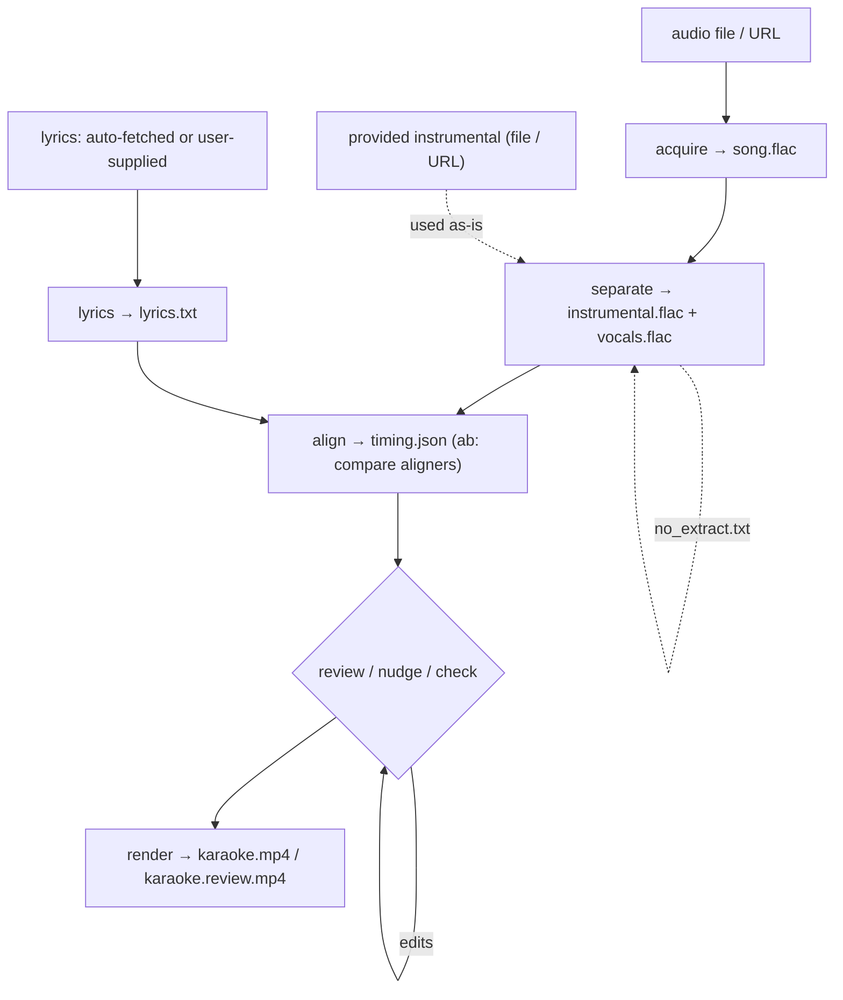

# Code

Exploration of how the code is organized, with brief discussion and explanation of test coverage.

**Contents**

- [Data Flow](#data-flow)
- [Module Map](#module-map)
- [Design Notes](#design-notes)
- [Audio format and flow](#audio-format-and-flow)
- [Tests](#tests)

## Data Flow



## Module Map

The `karaoke` package is organized by responsibility:

| Area | Modules | Responsibility |
|------|---------|----------------|
| **Entry** | `cli.py`, `pipeline.py` | Command parsing; stage orchestration + caching. |
| **Config / paths** | `config.py`, `paths.py`, `metadata.py`, `timeparse.py` | Settings, per-song file locations, artist/title resolution, `M:SS` time parsing. |
| **Acquire / separate / lyrics** | `acquire.py`, `separate.py`, `no_extract.py`, `lyrics.py` | Get audio, split stems (+ original-mix splicing), fetch lyrics. |
| **Alignment** | `align.py`, `reconcile.py`, `onsets.py`, `realign.py` | Whisper + `MMS_FA` aligners, lyric↔ASR reconciliation, onset snapping, windowed forced alignment. |
| **Timing model** | `timing.py`, `nudge.py`, `preflight.py`, `linesplit.py`, `fill.py` | `timing.json` data model, manual correction, validation, line splitting, per-word fill interpolation. |
| **Render** | `render/` (`__init__.py`, `draw.py`, `pillow.py`, `encode.py`) | Frame-state assembly → Pillow drawing → FFmpeg encode. |
| **Bookkeeping** | `history.py` | Per-song `history.csv` logging. |

Between them these cover every module in the package (`__init__.py` is just the package marker); there is no leftover "other" bucket.

## Design Notes

- **Stages are thin wrappers over cached artifacts.** Each stage reads its inputs from the song folder and writes its output there; re-running skips when the output exists (`--force` redoes). This keeps stages independently runnable.
- **Pure logic is separated from I/O.** Timing math, fill interpolation, parsing, and config are pure and unit-tested; the heavy ML/network stages and rendering
  sit behind thin, mockable interfaces.
- **The aligner is a swappable interface** ([Whisper](Models.md#alignment--two-approaches) vs [`MMS_FA`](Models.md#alignment--two-approaches)), which is what makes the A/B aligner comparison possible; rendering sits behind a small `Renderer` interface, too.

## Audio format and flow

The pipeline standardizes on **one lossless working format**: `song.flac` and the separated `instrumental.flac` / `vocals.flac`, all 44.1 kHz / 16-bit stereo. Every stage reads and writes the same thing, so no stage branches on format or stacks another lossy re-encode on the last.

<details>
<summary>Why one format, what YouTube provides, and the trade-off</summary>

**Lossy vs lossless, briefly.** Lossy codecs (MP3, AAC, Opus) shrink audio by discarding detail you're unlikely to notice, and every re-encode discards a little more; lossless codecs (FLAC, WAV) compress with no loss, so re-saving costs nothing in quality. *Transcoding* is converting between codecs, and *bitrate* (kbps) is roughly the bits spent per second of audio: higher means more detail, but only up to the source's real fidelity.

**What a source provides.** A YouTube pull is always lossy: the best audio-only stream is typically Opus around 130–160 kbps (or AAC ~130 kbps), with lower fallbacks (~50 kbps) also offered. That source is the fidelity ceiling: nothing downstream can add detail back. A local file is whatever you supply, lossy or lossless.

**How audio moves through the stages.**
- **acquire** decodes the source and re-encodes it once to `song.flac` (resampling to 44.1 kHz / 16-bit).
- **separate** decodes `song.flac`, runs Demucs, and writes `instrumental.flac` + `vocals.flac`.
- **align** decodes `vocals.flac` for the aligner: audio in, word timings out; the audio itself is not rewritten.
- **render** muxes the chosen audio (instrumental, or full for the review copy) into the MP4, where it is encoded to AAC (`audio.bitrate`, default 320k) for broad playback.

**Why a consistent format helps the code.** With every stage assuming the same container, rate, and bit depth: there is no per-stage format handling, the stems line up sample-for-sample with the source (which `no_extract` splicing and timing↔audio mapping rely on), and no accidental generation-loss creeps in between stages. FLAC is also the right default when the input is a lossless local rip.

**The trade-off, and alternatives.** When the source is already lossy (a YouTube pull), `song.flac` is lossless-wrapping lossy audio: roughly 5–6× the source's bytes for no fidelity gain over it. For one song at a time that is negligible; across a large library it adds up, so deleting `song.flac` and the `_download/` scratch folder after the final render is reasonable (stages are cached and re-runnable). If storage mattered more, the alternatives would be to keep the source codec when it is already compact, make the working format / sample rate configurable, or decode on the fly instead of persisting stems: each trades disk space for more format-handling in the code or repeated decode work. The current design favors a simple, uniform, loss-free flow over disk size.

</details>

## Tests

The suite is [`pytest`](https://docs.pytest.org)-based and lives in [`tests/`](../tests). Run it from the project root with the virtual environment active:

```bash
pytest            # or: python -m pytest
```

Because pure logic is kept separate from the heavy ML and I/O (see [Design Notes](#design-notes)), most tests are fast and deterministic: the ML and network stages are exercised through mocks rather than real model runs, so the suite needs no GPU, no downloads, and no sample audio.

Coverage by area:

- **Timing logic** (`test_timing`, `test_fill`, `test_linesplit`, `test_nudge`, `test_preflight`): the timing model and its validation, per-word fill interpolation, line splitting, nudge operations, and the preflight checks.
- **Alignment** (`test_align`, `test_reconcile`, `test_realign`, `test_onsets`): aligner behavior, lyric↔ASR reconciliation, windowed forced-alignment reflow, and onset snapping.
- **Initial processing** (`test_acquire`, `test_separate`, `test_separate_no_extract`, `test_no_extract`, `test_lyrics`, `test_lyrics_fetch`, `test_metadata`): audio ingest, stem separation and no-extract splicing, lyric fetch and parsing, and artist/title resolution.
- **Render** (`test_draw`, `test_render_pillow`, `test_encode`): frame drawing, the Pillow renderer, and the FFmpeg encode step.
- **Orchestration** (`test_cli`, `test_pipeline`, `test_ab`, `test_paths`, `test_config`, `test_history`, `test_history_integration`): command parsing, stage caching and orchestration, the A/B workflow, path resolution, config loading, and history logging.