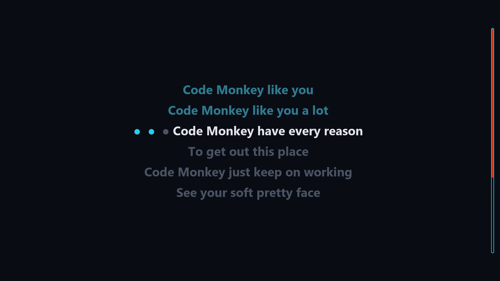
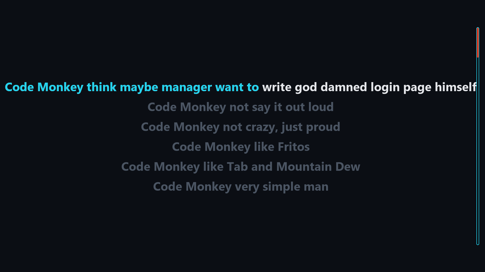
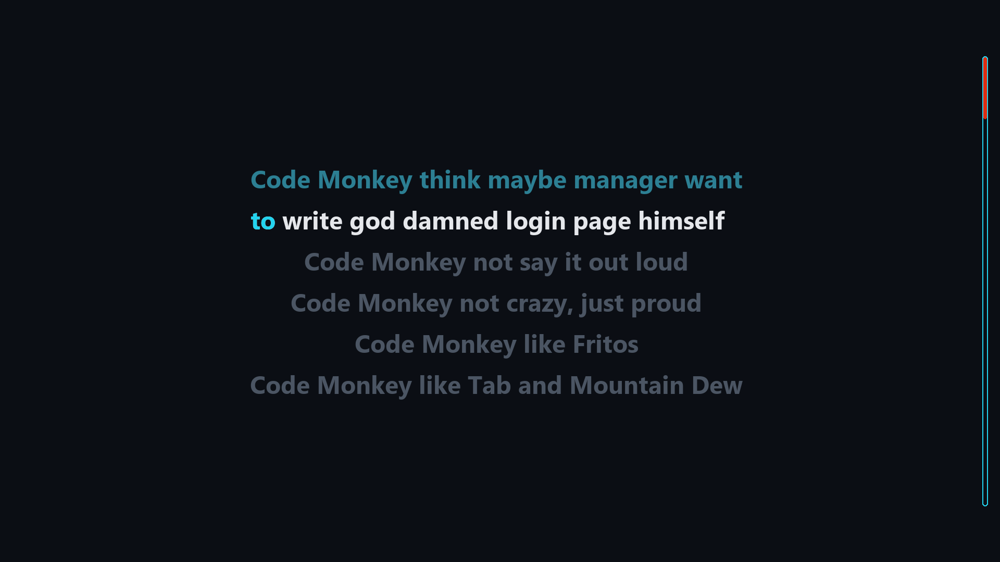
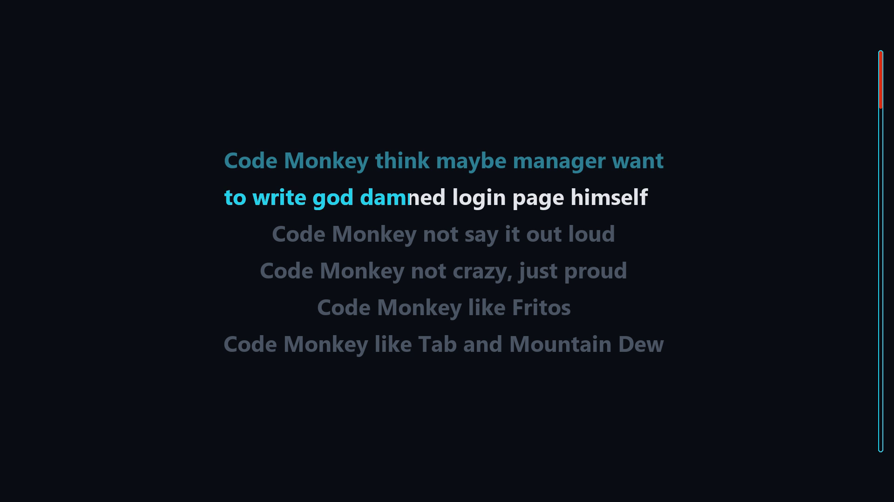

# Example Workflow

A freely-licensed song processed end to end: acquire → separate → lyrics → align → *A/B the two aligners* → keep the winner → check → nudge → final render. 

*A/B testing for aligners can be performed during the initial alignment, but was decided on after the fact in this case.*

For a reference on any single command, see **[Usage](Usage.md#usage)**.

The finished renders and clips from this walk-through are shown on the **[live demo page](https://nbpub.github.io/karaoke_vid_gen/)**.

**Contents**
- [Example Song and Introduction](#the-example-song)
  - [History Log](#the-history-log)
- [1. Acquire the audio](#1-acquire-the-audio)
- [2. Separate the stems](#2-separate-the-stems)
- [3. Get the lyrics](#3-get-the-lyrics)
- [4. First-pass alignment](#4-first-pass-alignment)
- [5. A/B the two aligners](#5-ab-the-two-aligners)
- [6. Choose the A/B winner](#6-choose-ab-winner)
- [7. Check, nudge, and split](#7-check-nudge-and-split)
- [8. Final render](#8-final-render)

## The example song

This walkthrough uses **Jonathan Coulton — "Code Monkey"**, chosen because it's
released under a permissive Creative Commons license, so anyone can reproduce
this example.

- **Artist:** Jonathan Coulton — [jonathancoulton.com](https://www.jonathancoulton.com/)
- **Song:** "Code Monkey" (2006) — [Wikipedia](https://en.wikipedia.org/wiki/Code_Monkey_(song))
- **Listen / source:** [YouTube](https://www.youtube.com/watch?v=AEBld6I_AKs)
  - *free download is also available from the artist's site*
- **License:** Creative Commons **Attribution-NonCommercial 3.0**
  ([CC BY-NC 3.0](https://creativecommons.org/licenses/by-nc/3.0/))

Thanks to Jonathan Coulton for releasing their music under Creative Commons. Please respect the license: attribute the artist and keep any use non-commercial. This project is a personal tool and is **not affiliated with, nor endorsed by, the artist**.


Each stage prints `[run]  <stage>` when it does work, or `[skip]  <stage>` when a cached output already exists (re-run with `--force` to redo). Some example outputs are shown below.

**Tip:** 
Run every stage in [one pass](Usage.md#all--run-the-whole-pipeline) with `karaoke all "Jonathan Coulton - Code Monkey" "<url or file>"`. Change the look and other behavior by editing `config.toml` (see [Configuration](Configuration.md#configuration)).

### History Log

Every real operation described below (align / ab-keep / nudge / render / split) appended a row to `history.csv` in the song folder: a readable record of how this song's timing was produced. See [Features → history log](Features.md#per-song-history-log).

The log is stored as CSV; its columns are `timestamp, op, model, seed, source,
whisper_params, timing_mtime, render_mode, encoder, duration, notes`. An abbreviated look at this song's log is shown in the table below.


| op | model | source | render_mode | encoder | duration | notes |
|----|-------|--------|-------------|---------|----------|-------|
| align | whisper | align-cold | | | 1m47s | |
| render | whisper | ab-cold | review | nvenc (GPU) | 1m53s | ab-gen |
| render | mms | ab-cold | review | nvenc (GPU) | 1m48s | ab-gen |
| ab-keep | mms | ab-keep | | | | kept mms |
| split | mms | ab-keep | | | 0s | re-segment +0, auto-wrapped 1 |
| render | mms | ab-keep | both | nvenc (GPU) | 4m43s | |

The two `ab-gen` rows are the A/B arms (Whisper then MMS); `ab-keep` promotes MMS;
`split` auto-wraps the one over-wide line; the final `both` render produces the
shipped `karaoke.mp4` + `karaoke.review.mp4`. The single `align` row is the §4 cold
pass (Whisper), which `ab` reused as its Whisper arm; MMS is aligned inside `ab` and
gets no separate `align` row: its `render mms … ab-gen` row stands in for that
alignment.

## 1. Acquire the audio

Fetch the audio from a URL (or point at a local download from the artist's site)
and normalize it to `song.flac`:

```bash
karaoke acquire "Jonathan Coulton - Code Monkey" "https://www.youtube.com/watch?v=AEBld6I_AKs"

# or

karaoke acquire "Jonathan Coulton - Code Monkey" "path/to/Code Monkey.mp3"
```

All commands here are run from the **project root** with the virtual environment activated. After this `acquire` step, the repeated `"Jonathan Coulton - Code Monkey"` option to commands would not be necessary if running them from the created song folder. 

Downloads and saves as `song.flac`. A local download from the artist's site works the same way: pass the file path instead of the URL (the second form above). In this case the song file will simply be copied and the extension changed, if necessary. See [Code → Audio format and flow](Code.md#audio-format-and-flow) for how the audio is stored and flows through the pipeline.

`acquire` creates the song folder at `<songs-dir>/Jonathan Coulton - Code Monkey/`
— the songs directory is `songs/` by default (or `[paths].songs_dir` in [config](Configuration.md#configuration)) —
and prints it as `[song]  <path>` so you can confirm where files are being written
before the download starts.

For a YouTube URL you may see a **"No supported JavaScript runtime"** warning from
yt-dlp. Audio-only downloads usually still succeed; installing Deno clears it and
keeps extraction robust. See
[Installation → YouTube & a JavaScript runtime](Installation.md#youtube--a-javascript-runtime).

## 2. Separate the stems

Split the vocal from the backing ([Demucs](Models.md#source-separation--demucs),
GPU) → `instrumental.flac` + `vocals.flac`:

```bash
karaoke separate "Jonathan Coulton - Code Monkey"
```

```text
[song]  songs/Jonathan Coulton - Code Monkey
Selected model is a bag of 1 models. You will see that many progress bars per track.
Separating track songs/Jonathan Coulton - Code Monkey/song.flac
100%|███████████████████████████████| 193.05/193.05 [00:11<00:00, 16.71seconds/s]
[run]  separate
```

Demucs prints a model-selection line and a per-track progress bar.

## 3. Get the lyrics

Auto-fetch the lyrics (LRCLIB → lyrics.ovh), falling back to manual paste, into
`lyrics.txt`:

```bash
karaoke lyrics "Jonathan Coulton - Code Monkey"
```

For this song the auto-fetch returned the full, correct lyrics: no manual paste 
was needed, and there were no issues to fix. If a fetch fails, the command falls back to pasting the lyrics in yourself (copy lyrics and paste into `lyrics.txt` within song folder).

<details>
<summary><strong>Common lyric issues</strong> to watch for</summary>

Lyric sites often add non-sung text that corrupts alignment. Watch for:

<ul>
<li>section markers (<code>[Chorus]</code>, <code>[Verse 2]</code>)</li>
<li>repeat shortcuts (<code>(x4)</code>, <code>Chorus 2x</code>)</li>
<li>stray footer lines ("you might also like …")</li>
</ul>

Also spell out numerals (`5` → `five`): both aligners handle digits poorly.
`check` flags common artifacts, but a quick read of `lyrics.txt` before aligning
is worth it.

</details>

## 4. First-pass alignment

Align the known lyrics to the vocal stem into an editable `timing.json`:

```bash
karaoke align "Jonathan Coulton - Code Monkey"
karaoke render "Jonathan Coulton - Code Monkey"   # review copy
```

On Windows the Whisper step may print a Triton-kernel warning; it's harmless
(the model still runs on the GPU). See
[Installation → expected warnings](Installation.md#expected-warnings).

Watch `karaoke.review.mp4` and note where the auto-timing is off.

The render `mode` defaults to `review`
(`karaoke.review.mp4`): full audio — vocals + instrumental — on `timing.json`'s
exact time-base, so you can hear the words against the fill and read times
straight off the video while correcting. 

The **final** `karaoke.mp4` plays the
*instrumental* and adds the title-card lead-in. You typically review and fix the
timing first, then render the final with `--mode both` (or `--mode karaoke`). 

See [Usage → `render`](Usage.md#render--make-the-video).


## 5. A/B the two aligners

Generate **both** aligners' timings + review videos (without touching the
canonical files) and compare.

<details>
<summary><strong>Motivation</strong></summary>

Reviewing this first pass (the default Whisper aligner) showed the timing was
off in spots, so rather than hand-fix blind, it was worth comparing against the
MMS_FA aligner. `ab` runs both so you can watch them side by side; the
differences for this song are in
[the verdict below](#the-verdict-for-this-song-mms).

</details>


```bash
karaoke ab "Jonathan Coulton - Code Monkey"
```

```text
[run]  ab align [whisper]
[run]  render
[run]  ab align [mms]
[run]  render
[ab] generated timing.whisper.json, timing.mms.json + review videos
[ab] review, then consolidate: karaoke ab "Jonathan Coulton - Code Monkey" --keep whisper|mms
```

This writes `timing.whisper.json` / `timing.mms.json` and
`karaoke.review.whisper.mp4` / `karaoke.review.mms.mp4`. Watch both.

### The verdict for this song:  MMS

Both versions had errors — neither was clean — but MMS had slightly fewer and
they were easier to fix. Observations were all consistent with the general patterns in [Models](Models.md#ab-whisper-vs-mms_fa):

- **MMS is tighter to the words** overall, but its fill **looks choppier**. 
  - the preference of choppier or smoother fill will come down to the taste of the user
- **Whisper handled long-held words better**
  - may be a *side effect of a consistent error* rather than a real strength, Whisper  frequently held the last word of a line until the start of the next line, over-holding rather than genuinely tracking the sustain.
- **Whisper lagged behind the song in a few places**, then caught up later.
- **MMS missed some of the long holds**, ending a sustained word's fill early

A concrete example of the difference is captured in the comparison clips around
**113–127 s** ("Code Monkey like you a lot"): Whisper is still filling the held
"lot" long after the word, while MMS finishes it early and moves on. That
over-hold even has a knock-on effect: it shortens the gap to the next line
enough to suppress the count-in that MMS's earlier finish leaves room for.



*The count-in (`●  ●  ●`) filling in the ~3 s before "Code Monkey have every
reason": two dots lit, one to go. It shows before the first line and before any
line that follows a gap of at least `count_in_min_gap_seconds`.*

## 6. Choose A/B Winner

Promote the chosen aligner to canonical (rename without model information) and remove the rest:

```bash
karaoke ab "Jonathan Coulton - Code Monkey" --keep mms
```

```text
[ab] kept mms -> timing.json + karaoke.review.mp4; removed timing.whisper.json, karaoke.review.whisper.mp4
```

The chosen timing, and associated render, becomes the canonical `timing.json` and `karaoke.review.mp4`, and the other model's labeled files are removed. Now this one timing file can be refined as needed.

**Keep the loser if you might want it later.** 

`--keep` *deletes* the other
model's labeled files, so if you expect to lift a few timings from the losing 
aligner (Whisper), such as a smoother-held note or a better-tracked repeat, rename `timing.whisper.json` to something outside the A/B naming (e.g. 
`reference-whisper.json`) *before* running `--keep`, and it won't be removed.

## 7. Check, nudge, and split

Validate the timing with [`check`](Usage.md#check--preflight-the-timing) (it also
runs automatically before `nudge` and `render`), then refine: hand-edit
`timing.json` or use the [`nudge`](Usage.md#nudge--hand-correct-timing) toolkit for
timing, and [`split`](Usage.md#split--fit-over-wide-lines) for any line too wide for
the frame.

### Nudge

Hand-correct any spots the aligner got wrong. On this song the kept **MMS**
timing was already accurate enough that no `nudge` operations were needed:
only a handful of small start/end tweaks made directly in `timing.json`, and no
background-vocal words or no-extract intervals to mark. When a song needs
correcting, `nudge` is the tool: coarse shifts, per-line anchors, or a marked-line reflow:

```bash
karaoke nudge "Jonathan Coulton - Code Monkey" --list         # numbered lines + times
# the --list output may be unwieldy in a terminal window, using a text editor is recommended
karaoke nudge "Jonathan Coulton - Code Monkey" --shift 8=1:06  # e.g. start line 8 at 1:06
```

The `check` runs automatically before `nudge` and `render` (errors halt); after a
mutating nudge it re-checks and reports any overlaps the reflow introduced. See
[Usage → `nudge`](Usage.md#nudge--hand-correct-timing) for the full toolkit.

**Marking a line for `--fill-cleared`.** When a line is a little off — the fill
starts late, or the internal word timing could be tighter — you mark it in
`timing.json` and let the forced aligner re-time its words within a window you
bound. The convention: on the line's first word set `start` to where the line
should begin and `end` to `0`; optionally, on the last word set `start` to `0`
and `end` to the approximate line finish. For example, to re-flow *"Code Monkey
not say it out loud"* so it starts at `29.00` and ends around `32.20`:

```json
{ "words": [
  { "text": "Code",   "start": 29.00, "end": 0 },
  { "text": "Monkey", "start": 29.44, "end": 29.76 },
  { "text": "not",    "start": 29.82, "end": 30.06 },
  { "text": "say",    "start": 30.08, "end": 30.38 },
  { "text": "it",     "start": 30.48, "end": 30.60 },
  { "text": "out",    "start": 31.15, "end": 31.52 },
  { "text": "loud",   "start": 0,     "end": 32.20 }
] }
```

The first word's `"end": 0` (with its `start`) is the mark and anchors the
line's start; the last word's `"start": 0` (with its `end`) bounds the finish.
The words in between keep their values for now: the reflow re-times them across
`[29.00, ~32.20]`. Then run `karaoke nudge "Jonathan Coulton - Code Monkey"
--fill-cleared`.

The reflow re-times the marked line's words by localized **MMS_FA** forced
alignment inside the window your marks define (the start/end you set, plus a small
search margin), so the in-between words land on the actual vocal onsets rather
than being spaced evenly. It falls back to length-based interpolation if torch or
the model isn't available.

### Split

On this song the preflight flags one line as too wide for
the frame, based on `font_size` and `usable_width_frac` in
[config](Configuration.md#render):

```bash
karaoke check "Jonathan Coulton - Code Monkey"
```

```text
1 error(s), 1 warning(s)
[ERROR] line_too_wide (-): Line(s) detected that will extend past the video window, break up to ensure all lyrics visible
    line 9: Code Monkey think maybe manager want to write god damned login page himself
[WARN] stale_render (-): timing.json was modified after the rendered video - re-render (with --force) to avoid shipping a stale video
```
*also note the stale render warning, `--force` would be needed to render videos with the updated timing*



*The flagged line (top) overflowing the frame, before splitting.*

Changing a line boundary is perfectly safe: that's exactly what manual-assist
[`split`](Usage.md#split--fit-over-wide-lines) does, losslessly.

Now fit the wide line with `split`: auto-split balances it into the fewest rows
that fit (rendered as a left-justified block); each word keeps its time, so no
re-alignment is needed:

```bash
karaoke split "Jonathan Coulton - Code Monkey"
```

```text
[split] re-segment +0 line(s); auto-wrapped 1 line(s); backup at timing.json.bak
```

`re-segment +0` means `lyrics.txt`'s line structure already matched the timing
(nothing to re-segment); the one over-wide line was auto-wrapped. A re-check is
now clean apart from the expected stale-render notice:

```text
0 error(s), 1 warning(s)
[WARN] stale_render (-): timing.json was modified after the rendered video - re-render (with --force) to avoid shipping a stale video
```



*After auto-split: the line balanced into a left-justified block (the subtle "wrapped" cue).*

### Lyric Fixes After Alignment

Fixing a misheard lyric, correcting a fetch, or spelling out a numeral in
`lyrics.txt` makes `check` report a
[`lyrics_text_mismatch`](Features.md#preflight-check), `lyrics.txt` and `timing.json` should hold exactly the same words. Two ways
forward:

- **Keep your alignment**
  - mirror the edit in `timing.json` (add, remove, or
  retype the word there, hand-timing anything you added)
  - more work, but it
  preserves the aligner version you chose and timing adjustments you've
  already made
- **Re-align**
  - run [`align`](Usage.md#align--time-the-words) again to rebuild the
  timing from the new lyrics
  - much simpler, but it discards all manual timing
  edits and re-does the alignment you settled on in the A/B


## 8. Final render

Render both outputs and force a fresh encode after the timing edits:

```bash
karaoke render "Jonathan Coulton - Code Monkey" --mode both --force
```

This produces `karaoke.mp4` (instrumental, ~3:13, with the title-card lead-in)
and `karaoke.review.mp4` (full audio, ~3:09, no lead-in, so its time-base matches
`timing.json`). Both encoded with NVENC on the GPU.

The title-card lead-in only *adds* time when the singing would otherwise start too
early to read the card; when the first line already starts late enough, no delay is
added and the two outputs share the same time-base.



The frame above shows the look: stacked lyrics with the
per-word fill sweeping across the active line in cyan, already-sung lines in
the dimmer past color, upcoming lines greyed, and the song progress bar down
the right edge. It also shows the auto-split line from step 7: "…to write god
damned login page himself" is the left-justified continuation row, the subtle cue that the line was wrapped.

**Instrumental Wait Bar** 

"Code Monkey" has no instrumental break long enough to trigger the **wait bar**, so that one element isn't exemplified by this song. (Count-in dots still appear: before the first line and any shorter mid-song gaps.) See
[Features → rendered frame elements](Features.md#rendered-frame-elements) for an example.